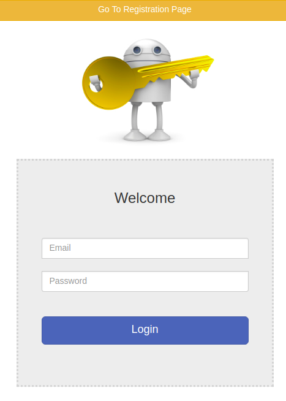
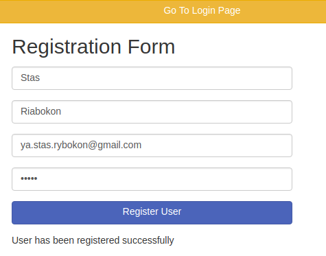
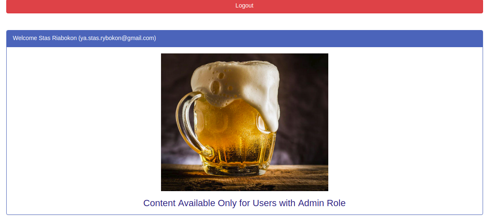

# Spring-security
Spring MVC+Security application

## Preview
<b>Start page of the application is login page, that looks like:</b>
  
<b>Page for registration new user</b>
  
<b>Admin page looks like:</b>
  
## How To Use
In order to launch an application type `./mvnw spring-boot:run` in command line and then open http://localhost:8080/ in your browser.
## Built With
* [Spring Framework (MVC, Security, Data)](https://spring.io/) - The framework used
* [Maven](https://maven.apache.org/) - Dependency Management
* [Thymeleaf](https://www.thymeleaf.org/) - Template engine
* [MySql](https://www.mysql.com/) - The database used
